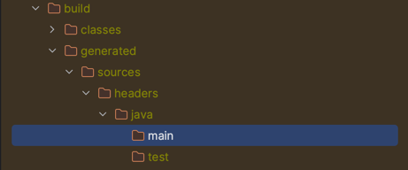

# QueryDsl

## SpringBoot 3.x 버전 이상 설정

##  build.gradle
```java
dependencies {
    // 그 외 라이브러리들...

    //querydsl 설정 추가
    implementation 'com.querydsl:querydsl-jpa:5.0.0:jakarta'
    annotationProcessor "com.querydsl:querydsl-apt:5.0.0:jakarta"
    annotationProcessor "jakarta.annotation:jakarta.annotation-api"
    annotationProcessor "jakarta.persistence:jakarta.persistence-api"
    
    }

    tasks.named('test') {
    useJUnitPlatform()
    }

    // 1. Querydsl 설정부
    def generated = 'src/main/generated'

    // querydsl QClass 파일 생성 위치를 지정
    tasks.withType(JavaCompile) {
    options.getGeneratedSourceOutputDirectory().set(file(generated))
    }

    // java source set 에 querydsl QClass 위치 추가
    sourceSets {
    main.java.srcDirs += [ generated ]
    }

    // gradle clean 시에 QClass 디렉토리 삭제
    clean {
    delete file(generated)
    }
```
---

### 1. Querydsl 설정부 
>def generated = 'src/main/generated'

gradle을 build 하면


해당 패키지에 QueryDsl 클래스 들이 생성되는데 생성되는 클래스들의 위치를 src/main/generated 로 변경